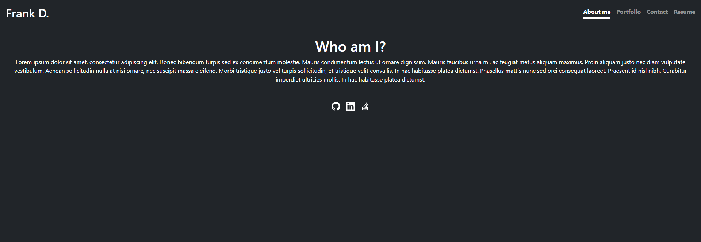

# SPA Portfolio

## Purpose
To create an updated portfolio using ReactJS and design it as a single-page application(SPA). The portfolio contains various projects and links to them as well as a short bio and a downloadable resume.

## Built With
* ReactJS
* Bootstrap
* HTML
* CSS

## Contents
The code contians a public folder and src folder as well as package.json files. The public folder contains the images, the resume in a pdf format, and the index.html file. The src folder contians the componenets folder and within that all of the pieces used to construct the webpage, a utils folder with helpers, the add.js and add.css files, index.js and index.css files, and the last two files are the reportWebVitals.js and setupTest.js.  

## Screenshot

## Deployed At
https://dragoonkite.github.io/spa-portfolio/

## Contribution
Made with ❤️ by DragoonKite

### ©️2021 Frank DePaolo
